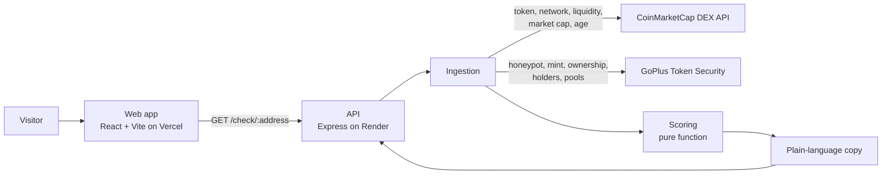

# TokenLens

**Check a token before you buy it.** Paste a token's contract address and get a
plain-language verdict: can you sell it, can more coins be created, who
controls it, and can the money behind it be pulled?

TokenLens is built for the casual trader who acts on a tip from Telegram or X,
has a wallet, but can't read liquidity depth or holder concentration. Instead of
a dashboard of numbers, it gives one traffic-light answer with the reasons in
plain words. Made for the **Build with CMC: API Hackathon** (DoraHacks).

- Web app: https://tokenlens-eight.vercel.app/
- API: https://tokenlens-sxdq.onrender.com (try `/health`)

The API runs on a free host that a scheduled ping keeps awake, so checks answer
in a few seconds. After a redeploy or restart the first check can take a little
longer.

## Try it

Open the web app and tap **PEPE on Ethereum** or **BONK on Solana**. Or call the
API directly:

```
curl https://tokenlens-sxdq.onrender.com/check/0x6982508145454ce325ddbe47a25d4ec3d2311933
```

Any check can be shared as a link: `?token=<address>&network=<id>` runs
automatically when opened.

## What the colors mean

| Verdict | Meaning |
|---|---|
| 🔴 Red | A serious problem was found: for example a honeypot (you can buy but not sell), coins that can still be created, or unlocked liquidity on a new token |
| 🟡 Yellow | Something needs care: unlocked liquidity on an older token, creators still in control, thin liquidity, a very new token, concentrated holders, or a check that couldn't be completed |
| 🟢 Green | The checks that could be run came back clean. The explanation lists only what was actually confirmed |
| ⚪ Grey | Not enough data to say anything |

Two rules run through everything:

1. **Unknown is never treated as safe.** Every security field is true, false or
   unknown. If a scan isn't available the verdict is capped at yellow.
2. **A green never hides its limits.** Some tokens hold most of their liquidity
   in concentrated pools, where a classic liquidity lock can't be verified. A
   token that is old, liquid and widely held, with clean mint and ownership, can
   still be green, but the page shows a caveat saying exactly what couldn't be
   verified. A known-unlocked pool is never excused this way.

The scoring rules live in one small pure function (`scoring.js`) with named
thresholds, so they are easy to read and test.

## How it works



1. **Ingestion** (`ingestion.js`, `goplus.js`) finds the token on CoinMarketCap
   by address, picks the right network (the same address can exist on several),
   then asks GoPlus for security data on that network. Every failure degrades
   gracefully and never throws: the record simply says what is unknown.
2. **Scoring** (`scoring.js`) turns the record into a verdict, reasons and any
   caveats. It has no network access, so it is fully testable.
3. **Copy** (`copyGenerator.js`) builds the plain-language message.
4. **API** (`routes.js`, `server.js`) exposes it over HTTP.
5. **Web app** (`frontend/`) shows the verdict as a full-width color band, with
   an expandable "See the data" section for the numbers behind it.

### How CoinMarketCap's API is used

- `GET /v1/dex/search?q=<address>` — finds the token by contract address and
  returns its network, liquidity, market cap, volume, price and first-pool
  timestamps. Used for every check.
- `GET /v1/cryptocurrency/quotes/latest` — a degraded fallback when the DEX
  search fails, so the API still answers (with a capped verdict).
- `GET /v1/dex/platform/list` — CoinMarketCap's network IDs are mapped to
  GoPlus chain IDs; the mapping was verified against this list (it is not
  called at runtime).

Security details come from GoPlus (`/api/v1/token_security/{chainId}` for EVM
networks and a separate endpoint for Solana). Networks with a full security scan:
Ethereum, BNB Chain, Base, Arbitrum, Avalanche and Solana. Tokens on other
networks still get a market-data check, capped at yellow.

## API

`GET /check/:tokenAddress?networkId=<id>` — `networkId` is optional (CoinMarketCap's
network ID); leave it out to auto-detect, in which case the network with the
deepest liquidity wins.

Abridged example response:

```json
{
  "tokenAddress": "0x6982508145454ce325ddbe47a25d4ec3d2311933",
  "networkId": 1,
  "networkName": "Ethereum",
  "alsoOnNetworks": ["PulseChain", "Unichain"],
  "verdict": "yellow",
  "reasons": ["Liquidity isn't locked, so it could be pulled out. This token has been trading for a while, which lowers that risk but doesn't remove it."],
  "caveats": [],
  "message": "🟡 Proceed with caution. … This is an automated check, not financial advice.",
  "dataSource": "dex",
  "degradedReason": null,
  "data": {
    "symbol": "PEPE",
    "liquidityUsd": 32400000,
    "holderCount": 593875,
    "isHoneypot": false,
    "mintFunctionActive": false,
    "liquidityLocked": false,
    "ownershipRenounced": true,
    "concentratedLiquidityPct": 0.5,
    "securitySource": "goplus"
  }
}
```

In `data`, `null` always means unknown, never "no". Other routes: `GET /health`,
`POST /watch` and `GET /watchlist` (an in-memory watchlist; alerts are not built
yet).

## Keeping a public API safe

Every check that isn't answered from memory spends CoinMarketCap credits, so the
API protects them:

- **Answer cache.** An identical check (same address and network) is answered
  from memory for 60 seconds. Simultaneous requests for the same token share one
  lookup. A partial answer, where a data source hiccuped, is kept for only 10
  seconds so it heals quickly. Responses carry an `X-Cache: HIT` or `MISS`
  header.
- **Per-visitor rate limit.** 30 requests a minute per IP, answered with a plain
  message and a `Retry-After` header.
- **Shared lookup budget.** At most 100 lookups per 10 minutes reach the paid
  APIs across all visitors. Beyond that new tokens get a "very busy" answer
  (HTTP 503) while already-cached tokens keep working.
- `/` and `/health` are never limited and never call an upstream API, so a
  keep-alive ping is free.
- The watchlist is capped at 500 entries.

All limits can be changed with the environment variables below. Behind a
proxy the limiter must see each visitor's real IP. Requests reach the API through
Cloudflare and then Render's own proxy, each adding an address to
`X-Forwarded-For`, and Render doesn't strip values a visitor sends. TokenLens
therefore trusts exactly three hops rather than the whole header, so a spoofed
header can't fool it. To confirm, `GET /ip` should return your own IP address.

## Run it locally

You need Node 20 or newer and a CoinMarketCap API key.

Backend:

```
npm install
cp .env.example .env      # then put your key in CMC_API_KEY
npm start                 # http://localhost:3000
```

Web app:

```
cd frontend
npm install
npm run dev               # http://localhost:5173
```

The web app talks to the deployed API by default. To use your local one, set
`VITE_API_URL=http://localhost:3000` in `frontend/.env`.

| Variable | Where | Purpose |
|---|---|---|
| `CMC_API_KEY` | backend (required) | CoinMarketCap API key. Never commit it |
| `PORT` | backend | Port to listen on (hosts set this) |
| `CORS_ORIGIN` | backend | Restrict which site may call the API. Open by default |
| `TRUST_PROXY` | backend | How many proxy hops to trust when reading a visitor's IP (default 3, which is right for Render; use 0 locally) |
| `RATE_LIMIT_PER_MIN` | backend | Checks allowed per visitor per minute (default 30) |
| `MAX_LOOKUPS_PER_10_MIN` | backend | Lookups that reach the paid APIs, for everyone combined (default 100) |
| `CACHE_TTL_SECONDS` | backend | How long a good answer is reused (default 60) |
| `VITE_API_URL` | frontend | Where the API lives |

## Tests

```
node test_scoring.js
node test_ingestion.js
node test_routes.js
node test_realdata.js     # regression tests built from real captured responses
node test_protection.js   # cache, rate limit and lookup budget
cd frontend && npm test   # formatting and API-client tests
```

`test_realdata.js` replays real CoinMarketCap and GoPlus responses (PEPE on
Ethereum, BONK on Solana) with the network mocked, so it runs offline.

## Project layout

| Path | What it is |
|---|---|
| `ingestion.js` | Finds the token on CoinMarketCap and gathers its data |
| `goplus.js` | GoPlus security data, normalised to true / false / unknown |
| `scoring.js` | The verdict rules |
| `copyGenerator.js` | Plain-language message |
| `routes.js`, `server.js` | The API |
| `cache.js`, `rateLimit.js` | Answer cache and rate limiting |
| `frontend/` | The web app |
| `docs/` | Roadmap and a brief per working session |

## Honest limits

- Automated checks can't promise a token is safe. TokenLens is not financial
  advice, and says so on every result.
- GoPlus has no honeypot verdict for Solana, so that line reads "Not checked"
  there. Solana risk is judged from the mint, freeze and balance authorities.
- Liquidity locks can't be verified for concentrated-liquidity pools; the app
  says so instead of guessing.
- The API runs on a free host kept awake by a scheduled ping. The watchlist and
  the answer cache are in memory, so they are cleared on every redeploy or
  restart.
- Alerts (Telegram) are planned, not built yet.

## Roadmap

See [`docs/roadmap.md`](docs/roadmap.md) for the current plan and
[`docs/session-05.md`](docs/session-05.md) for the latest working notes.
